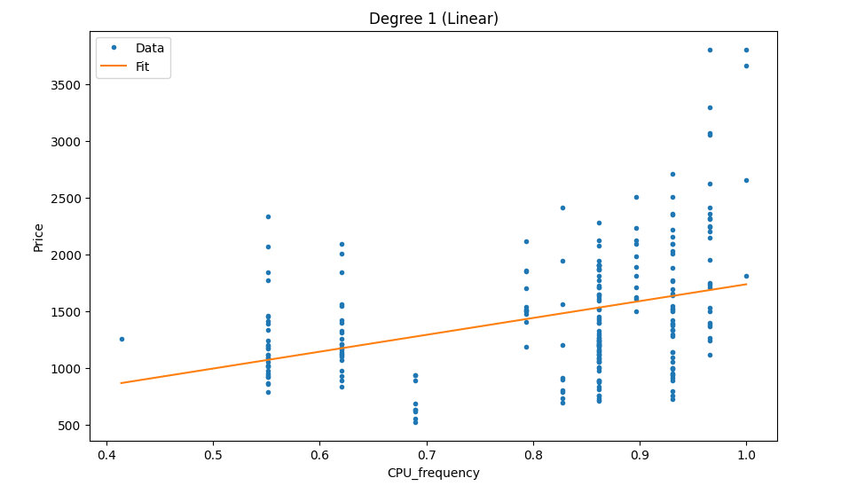
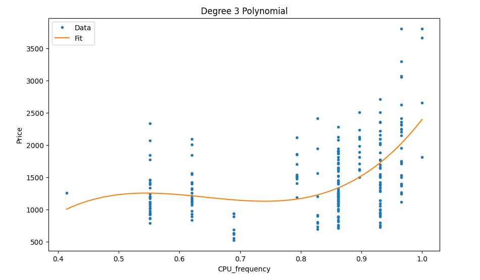
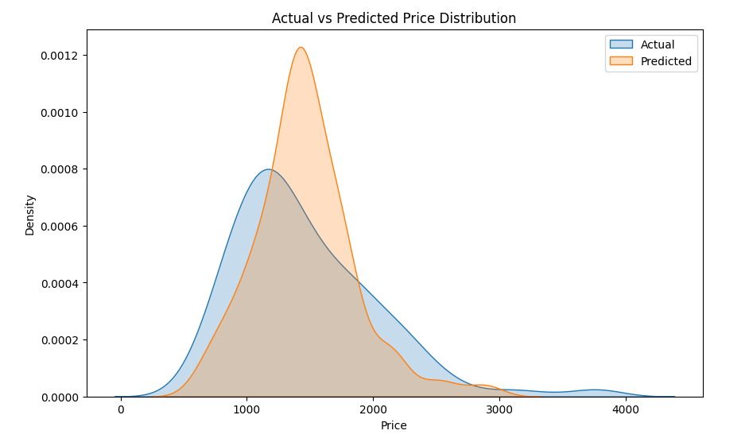

# laptop-price-regression-analysis
Regression analysis of laptop prices using linear, multiple, and polynomial models with evaluation using R², MSE, and visualization.
# Laptop Price Regression Analysis

## Overview
This project explores how different regression models can be used to predict laptop prices using various hardware features.

---

## Approach
- Simple Linear Regression using CPU frequency  
- Multiple Linear Regression using multiple features  
- Polynomial Regression to capture non-linear patterns  
- Model evaluation using R², MSE, and visualization  

---

## Key Visualizations

### Linear Model (Baseline)

Shows a general upward trend but does not fit the data well, indicating underfitting.

---

### Polynomial Model (Improved Fit)

Captures non-linear patterns in the data and provides a better fit than the linear model.

---

### Actual vs Predicted Distribution

Shows how closely the model’s predictions match the actual price distribution.

---

## Key Insights
- CPU frequency alone is not sufficient to predict laptop price  
- Using multiple features significantly improves model performance  
- Polynomial regression captures non-linear relationships  
- Increasing model complexity improves fit but must be controlled to avoid overfitting  

---

## Tools Used
- Python  
- Pandas  
- NumPy  
- Matplotlib & Seaborn  
- Scikit-learn  

---

## Conclusion
The Multiple Linear Regression model provided the best balance between accuracy and simplicity. Polynomial regression improved the fit by capturing non-linear patterns, but increasing model complexity must be carefully managed to avoid overfitting.

---

## Author
Diane King
